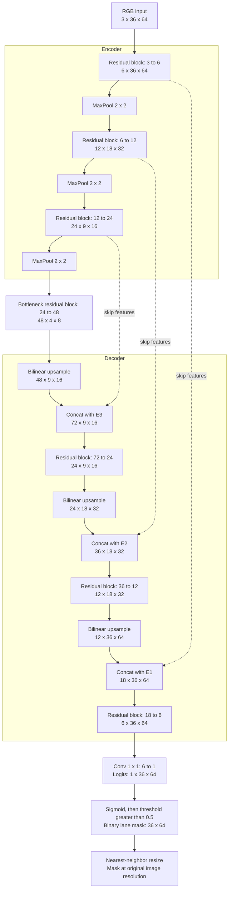
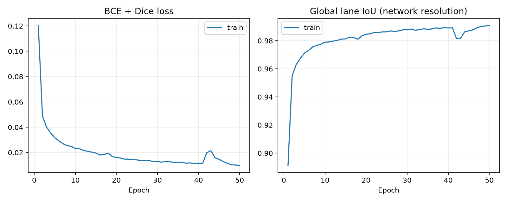
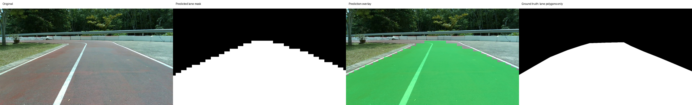

# Assignment-10 — Custom U-Net Lane Segmentation from Scratch

สร้าง network **LaneNet-v1** แบบ residual U-Net สำหรับ single-class binary lane segmentation และเทรนใหม่ทุก layer บน PSU-reservoir Dataset-Assignment-8 ใช้เฉพาะ polygon label `lane` ไม่ใช้ bounding boxes, polylines, polygon `sideway` หรือ `track-line` มาสร้าง target ไม่มี pretrained weights และไม่มี frozen layers

งานรอบนี้ดำเนินการตามข้อ 0–1.3 ซึ่งระบุ Custom U-Net แม้หัวเรื่องกล่าวถึง custom-YOLO-seg แต่รายการงานนี้ไม่ได้ระบุให้สร้าง/เทรน YOLO อีกโมเดล

## Input / output และโครงสร้างที่ออกแบบ

ใช้ convention **width × height × channels** ตามขนาดภาพ: input **64×36×3 RGB**, output **64×36×1 binary mask** ภายใน PyTorch คือ input N×3×36×64 และ logits N×1×36×64 ใช้ sigmoid > 0.5 เพื่อสร้าง binary mask 0/255 ทุก convolution เริ่มด้วย random Kaiming initialization



| Stage | Output C×H×W |
|---|---|
| RGB input | 3×36×64 |
| Encoder 1 | 6×36×64 |
| Encoder 2 | 12×18×32 |
| Encoder 3 | 24×9×16 |
| Bottleneck | 48×4×8 |
| Decoder 3 | 24×9×16 |
| Decoder 2 | 12×18×32 |
| Decoder 1 | 6×36×64 |
| Conv1×1 logits | 1×36×64 |

แต่ละ residual block = Conv3×3 → GroupNorm(3 groups) → ReLU → Conv3×3 → GroupNorm + shortcut → ReLU Shortcut เป็น identity เมื่อ channel เท่ากัน หรือ Conv1×1 เมื่อเปลี่ยน channel ทั้ง network มี **72,859 parameters**

เหตุผลในการออกแบบ:

- Channel 6/12/24/48 และ encoder 3 ระดับช่วยจำกัดจำนวน parameter และ activation memory สำหรับ laptop/PC
- U-Net skip connections นำรายละเอียด spatial กลับไปยัง decoder เพื่อแบ่งขอบพื้นที่เลน
- Residual connections ช่วย gradient ไหลระหว่างการเทรนจากศูนย์
- GroupNorm เหมาะกับ batch เล็กเพราะไม่ใช้ batch statistics
- Bilinear upsampling ไม่มี parameter เพิ่ม และ resize ตามขนาด skip โดยตรงเพื่อรองรับความสูง 9→4 ที่ max-pool
- Loss = 0.5 BCEWithLogits + 0.5 soft Dice รวมการจำแนก pixel กับความทับซ้อนของ foreground

ดู Mermaid ของ network และภายใน residual block ใน [custom-unet-architecture.md](custom-unet-architecture.md)

## Dataset: Train 65% / Test 35%

นำภาพที่มีจริงจาก Train และ Test เดิมมารวมกัน ตรวจภาพซ้ำด้วย SHA-256 แล้วเรียงตามหมายเลข frame เพื่อแบ่งใหม่ตามข้อกำหนดล่าสุด ไม่สุ่มเฟรมใกล้กันข้ามชุด

| Split | จำนวนภาพ | สัดส่วนจริง | การใช้ |
|---|---:|---:|---|
| Train | 681 | 64.98% | ใช้เทรนทุก epoch |
| Test | 367 | 35.02% | ใช้ประเมินหลังเทรนจบเท่านั้น |
| รวม | 1,048 | 100% | ภาพที่มีจริงและไม่ซ้ำ |

สัดส่วนคลาดจาก 65/35 เล็กน้อยเพราะจำนวนภาพต้องเป็นจำนวนเต็ม Train จบที่ frame 835 และ Test เริ่ม frame 836 ไม่มี validation แยก ไม่มี temporal gap และเลือก final checkpoint หลังครบ 50 epochs โดยไม่ใช้คะแนน Test

พบ XML อ้างถึงภาพที่ไม่มีไฟล์จริง 100 ภาพ (ช่วง 450–499 และ 600–649) และภาพซ้ำ 2 ภาพ จึงตัดออกพร้อม audit log ใน [dataset_manifest.json](dataset_manifest.json) ใช้เฉพาะข้อมูลที่มีจริง ผลนี้ยังอาจสัมพันธ์กันจากวิดีโอหรือเส้นทางเดียวกัน และไม่ยืนยัน generalization ไปยังการถ่ายครั้งอื่น

### รูปแบบ Ultralytics YOLO-seg polygon

```text
data65/
  images/train/*.jpg
  images/test/*.jpg
  labels/train/*.txt
  labels/test/*.txt
  manifest.json
```

หนึ่งบรรทัดต่อ polygon: `0 x1 y1 x2 y2 ... xn yn` มีอย่างน้อย 3 vertices และ normalized coordinates [0,1] Lane หลาย polygon รวมเป็น foreground class เดียว Rasterize mask ที่ขนาดต้นฉบับก่อน resize mask ด้วย nearest-neighbor และ resize RGB ด้วย bilinear รองรับภาพต้นฉบับหลายขนาด

Annotation ต้นฉบับของผู้ใช้เป็น CVAT XML ตัวแปลง `prepare_data.py` จึงเลือก `<polygon label="lane">` แล้ว export เป็น YOLO-seg ก่อนเทรน Syntax ของ YOLO txt เพียงอย่างเดียวแยก polyline ที่ export ผิดจาก polygon ไม่ได้ จึงต้องเลือกชนิดข้อมูลจากต้นทาง ไฟล์ label หายหรือ polygon ผิดรูปแบบถือเป็น error ภาพ negative ต้องมี label file ว่าง

## ติดตั้ง

ใช้ Python 3.10+; การรันจริงใช้ Python 3.12 บน Windows เปิด terminal ใน repo:

```powershell
py -m venv .venv
.venv\Scripts\Activate.ps1
python -m pip install torch --index-url https://download.pytorch.org/whl/cpu
python -m pip install -r requirements.txt
```

`requirements-lock.txt` บันทึกเวอร์ชันที่รันจริง ถ้าใช้ GPU ให้ติดตั้ง PyTorch build ที่เหมาะกับเครื่องและเลือก --device cuda

## คำสั่งรันซ้ำ

Output directories ต้องว่างเพื่อไม่ให้ผลเก่าปะปน หากรันใหม่ให้ใช้ชื่อ output ใหม่

### 1. เตรียมข้อมูลจาก CVAT เป็น YOLO-seg

```powershell
python prepare_data.py --source "C:\Users\ACER\Desktop\1-2569\353-Ecosystem\P_RATTACHAI\Dataset-Assignment-8" --output data65 --train-ratio 0.65 --archive-cache archive-cache --skip-missing
```

เปลี่ยน source เป็น path dataset ของเครื่องที่จะรัน `--skip-missing` ยืนยันการข้ามภาพที่ขาดพร้อมบันทึกใน manifest ถ้าไม่ระบุจะหยุดเมื่อพบภาพหาย

### 2. Train from scratch 50 epochs

```powershell
python train.py --data-root data65 --output runs/lane64x36_e50 --epochs 50 --batch-size 4 --width 64 --height 36 --base 6 --threads 4 --device cpu
tensorboard --logdir runs/lane64x36_e50/tensorboard
```

ใช้ AdamW, lr 0.001, weight decay 0.0001, seed 42, float32, batch 4 (ลดเป็น 2 ได้) ทุก layer รับ gradient และไม่โหลด checkpoint ก่อนเทรน Cache ภาพ/target ขนาด network ใน RAM เป็น uint8 เฉพาะ training เท่านั้น เก็บ `history.csv`, `loss.png`, TensorBoard scalars `loss/train` และ `iou/train`, config, environment, split manifest และ **model.pt จาก epoch 50**

Augmentation เฉพาะ Train: random white balance gain 0.94–1.06, brightness shift ±15/255 และ Gaussian blur sigma 0.1–0.6 เล็กน้อย Test ไม่ augment

### 3. Inference: binary masks ใต้ run/

```powershell
python inference.py --images-dir data65/images/test --labels-dir data65/labels/test --checkpoint runs/lane64x36_e50/model.pt --output run/test64x36_e50 --threads 4 --device cpu
```

ขนาด input อ่านจาก checkpoint ไฟล์ PNG binary masks ขนาด **64×36** อยู่ใน `run/test64x36_e50/masks/` และสำเนาขนาดภาพเดิมใน `native_masks/` พร้อม snapshot และ memory report ใช้ batch 1 กับ inference_mode

### 4. Evaluation และรายงาน

```powershell
python evaluation.py --images-dir data65/images/test --labels-dir data65/labels/test --pred-masks-dir run/test64x36_e50/masks --width 64 --height 36 --output run/test64x36_e50/metrics.json
python report.py --run runs/lane64x36_e50 --evaluation run/test64x36_e50/metrics.json --memory run/test64x36_e50/memory.json
python -m unittest discover -s tests -v
```

`evaluation.py` เรียก implementation ใน `evaluate.py` คำนวณ pixel-wise IoU = TP/(TP+FP+FN) ที่ขนาด 64×36 โดยไม่ใช้ภาพ native_masks ในการให้คะแนน นิยาม detected เป็น Yes เมื่อ GT มี lane และ **IoU > 0.6** (ค่าเท่ากับ 0.6 ไม่ผ่าน) Average IoU detected เฉลี่ยเฉพาะภาพ Yes หากไม่มีภาพผ่านให้ค่า null ทั้ง mask/GT ว่างให้ IoU 1 แต่ไม่นับเป็น lane detection Prediction ที่หาย ขนาดผิด หรือไม่ใช่ 0/255 จะหยุดด้วย error เพื่อไม่ละเว้น Test บางภาพโดยเงียบ

## ผลการรันจริงตามข้อกำหนดล่าสุด

<!-- RESULTS_START -->
### กราฟ loss และการลู่เข้า



เทรนจริง 50 epochs บน CPU, batch 4, float32, seed 42 ค่า train loss ลดจาก **0.120468** เป็น **0.009833** เวลา epoch loop **145.1 วินาที** บันทึกทุก epoch ใน [history.csv](runs/lane64x36_e50/history.csv)

กราฟนี้เป็น training loss การรันนี้ใช้ Train 65% ทั้งหมดและ Test 35% ไม่มี validation split แยก เลือก checkpoint epoch 50 ซึ่งเป็น epoch สุดท้ายตามที่กำหนดก่อนเทรน ไม่ใช้ Test เลือก checkpoint หรือ threshold การลดลงของ training loss แสดงการเรียนรู้ชุด Train; ประสิทธิภาพกับข้อมูลที่ไม่ได้ใช้เทรนดูจาก Test ด้านล่าง

### ค่าประสิทธิภาพของโมเดล

ประเมิน binary masks ที่ความละเอียด **width 64 × height 36** โดย rasterize GT polygon ที่ขนาดต้นฉบับก่อน resize ด้วย nearest-neighbor ใช้ sigmoid > 0.5 เป็น lane

| Metric | ผลจริง |
|---|---:|
| Test images | 367 |
| Global pixel-wise lane IoU | 0.824814 |
| Mean per-image IoU | 0.824852 |
| Dice / F1 | 0.903998 |
| Precision | 0.857182 |
| Recall | 0.956223 |
| Detected: GT lane and IoU > 0.6 | 367 / 367 |
| Detection rate | 100.00% |
| Average IoU of detected results | 0.824852 |

ผล Yes/No และคะแนน IoU รายภาพอยู่ใน [metrics.json](run/test64x36_e50/metrics.json) Detection rate คือการผ่านเกณฑ์ IoU > 0.6 ไม่ใช่ความถูกต้องทุก pixel Global IoU รวม TP/FP/FN ทุกภาพ ส่วน mean per-image IoU เฉลี่ยรายภาพ

### ตัวอย่างก่อนและหลัง inference



ภาพ `frame_0836_f21681.jpg` เป็นภาพแรกตามชื่อไฟล์ที่เลือกก่อนคำนวณคะแนน จากซ้าย: RGB ต้นฉบับ, binary lane mask, overlay สีเขียวหลัง inference และ GT จาก polygon lane ภาพแสดงผลขยายกลับขนาดเดิมเพื่อดูง่าย ไฟล์ผลหลักใน masks/ มีขนาด 64×36 และมี native_masks/ สำหรับภาพขนาดเดิม

### Memory footprint ที่วัดจริงระหว่าง inference

ระบบ **Windows-11-10.0.26300-SP0**, PyTorch **2.14.1+cpu**, CPU **Intel64 Family 6 Model 186 Stepping 2, GenuineIntel**, 4 threads, batch 1, float32, input width 64 × height 36 ใช้ inference_mode และ warmup 5 ครั้ง

| รายการ | ค่าที่วัดได้ |
|---|---:|
| Parameters | 72,859 |
| FP32 model parameters + buffers | 0.2779 MiB |
| Baseline RSS ก่อนโหลดโมเดล | 200.88 MiB |
| Sampled peak process RSS | 247.05 MiB |
| Peak RSS increase over baseline | 46.17 MiB |
| Windows lifetime peak working set | 252.98 MiB |
| Mean forward latency หลัง warmup | 2.19 ms/image |

RSS รวม Python, PyTorch, โหลด checkpoint, warmup, inference, image buffers, mask export และ snapshot อ่านทุก 10 ms จึงอาจพลาด peak สั้น ๆ Windows lifetime peak working set เป็นค่า OS ตลอด process รวมช่วงเริ่มโปรแกรมด้วย ขนาด parameter อย่างเดียวไม่ใช่ inference memory ทั้ง process ค่า latency วัดเฉพาะ forward ไม่รวม decode, preprocessing, sigmoid, resize และบันทึกไฟล์ การรันบน CPU จึงไม่มีค่า CUDA VRAM รายละเอียดใน [memory.json](run/test64x36_e50/memory.json)

<!-- RESULTS_END -->

## ลิงก์ GitHub สำหรับส่งงาน

**Submission repository:** [https://github.com/jkznx/custom-neural-network](https://github.com/jkznx/custom-neural-network)

ใช้ลิงก์ repository นี้สำหรับส่ง Assignment-10 โดยมีโค้ด, README, Mermaid architecture, checkpoint ที่เทรนแล้ว และผลการประเมินจริงครบใน repository

### เปรียบเทียบรอบ 30 และ 50 epochs

ใช้ชุด Train/Test, seed, optimizer และ augmentation เดียวกัน ตรวจแล้วว่า training trajectory ใน 30 epochs แรกตรงกัน และรายชื่อ Test ตรงกันทั้งหมด

| รอบเทรน | Final train loss | Global Test IoU | Test Dice / F1 |
|---|---:|---:|---:|
| 30 epochs | 0.012987 | 0.828676 | 0.906313 |
| 50 epochs | 0.009833 | 0.824814 | 0.903998 |

แม้ train loss ลดลง แต่ Test IoU ของรอบ 50 epochs ต่ำกว่ารอบ 30 epochs เล็กน้อย จึงไม่สรุปว่าการเทรนนานขึ้นทำให้ generalization ดีขึ้น รอบ 50 epochs เป็นผลหลักตามคำขอล่าสุด และไม่มีการเปลี่ยน checkpoint โดยอาศัยคะแนน Test

ผลรอบ 30 epochs เดิมเก็บไว้ใน `runs/lane64x36/` และ `run/test64x36/` เพื่ออ้างอิงประวัติ ส่วนผลหลักใน README นี้ใช้รอบ **50 epochs** ตามคำขอล่าสุด

## ข้อจำกัดและการส่งงาน

Input ขนาด 64×36 อาจทำให้ขอบเลนและพื้นที่แคบสูญหาย ผลคะแนนชุดนี้วัดที่ขนาด mask 64×36 จึงไม่ควรเทียบตรงกับคะแนนรอบเก่าที่วัดคนละ resolution และ split ผลรอบ 96×160 เดิมใน `runs/lane/` และ `run/test/` เป็นประวัติรอบก่อน ไม่ใช่ผลตามข้อกำหนดล่าสุด

ส่ง repo พร้อม README, Mermaid architecture, scripts, requirements, tests, dataset_manifest.json, `runs/lane64x36_e50/model.pt`, history/กราฟ loss และ `run/test64x36_e50/{metrics.json,memory.json,snapshot.png,predictions.json}` Dataset และ prediction masks จำนวนมากเก็บใน working directory local และถูก gitignore สามารถเตรียมใหม่จาก dataset ต้นทางได้

## ตัวอย่างงานที่เกี่ยวข้อง

- [Ultrafast Lane Detection](https://github.com/ibaiGorordo/Ultrafast-Lane-Detection-Inference-Pytorch-)
- [YOLOTL](https://github.com/Highsky7/YOLOTL)

ลิงก์เหล่านี้เป็นตัวอย่างที่ผู้สอนให้ศึกษา โครงการนี้ใช้ custom U-Net ที่เขียนเองและไม่ใช้ weights จากตัวอย่าง
