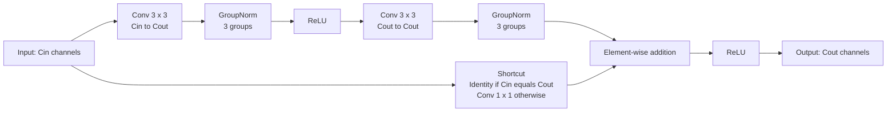

# LaneNet-v1 — Mermaid Architecture

แผนภาพนี้อ้างอิง implementation ใน [model.py](model.py) โดยตรง ใช้ `base=6`, input RGB 96×160 และแสดง tensor shape ในรูป **C × H × W** โดยไม่รวม batch dimension มี trainable parameters **72,859 ตัว** ทุก layer เทรนใหม่ตั้งแต่ต้น ไม่มี pretrained weights

## Network และ skip connections

เส้นทึบแสดงลำดับการคำนวณ เส้นประแสดง skip features จาก encoder ที่นำไป concat ใน decoder การ upsample เป็น bilinear และไม่ลดจำนวน channel จนกว่าจะผ่าน residual block ถัดไป ดังนั้น concat ใน decoder มี channel 48+24=72, 24+12=36 และ 12+6=18 ตามลำดับ

ส่วน sigmoid, threshold และ nearest-neighbor resize เป็นขั้น inference หลัง network ส่วนการเทรนส่ง raw logits เข้า BCEWithLogitsLoss โดยตรง ไม่ threshold ก่อนคำนวณ loss

## ภายใน residual block

Convolution 3×3 ใช้ padding 1 เพื่อรักษาขนาด spatial ส่วน shortcut ใช้ identity เมื่อจำนวน channel เท่ากัน และ Conv1×1 เมื่อจำนวน channel เปลี่ยน GroupNorm ใช้ 3 groups เพื่อรองรับ batch ขนาดเล็ก

## เหตุผลในการออกแบบ

- Encoder channel 6 → 12 → 24 → 48 และ downsample 3 ครั้ง ช่วยจำกัด parameter และ activation memory สำหรับ local machine
- Skip connections นำรายละเอียด spatial จาก encoder กลับไปยัง decoder
- Residual connections ช่วยให้ gradient ไหลผ่าน network ระหว่างการเทรนจากศูนย์
- Bilinear upsampling ไม่มี trainable parameter เพิ่ม
- GroupNorm ไม่ใช้ batch statistics จึงเหมาะกับการเทรน batch 2–4

ผลการเทรน กราฟ loss ภาพก่อน/หลัง และ memory footprint ที่วัดจริงอยู่ใน [README.md](README.md)
