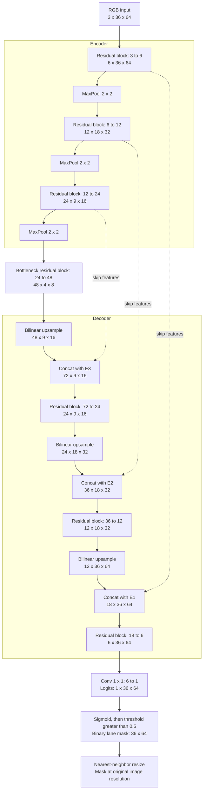
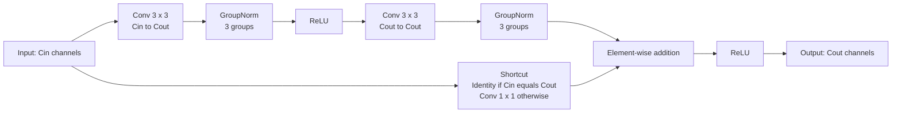

# Custom U-Net: LaneNet-v1 (64×36)

ขนาดใน assignment ใช้ convention **width × height × channels**: RGB 64×36×3 และ binary mask 64×36×1 PyTorch ใช้ tensor N×C×H×W จึงเป็น input N×3×36×64 และ logits N×1×36×64

## Network Mermaid

แผนภาพแสดง C×H×W ไม่รวม batch Concat มี channel 72, 36, 18 ตามลำดับ MaxPool ทำให้ความสูง 9 กลายเป็น 4 ที่ bottleneck; decoder จึง interpolate ไปยังขนาด skip โดยตรง (4→9) เพื่อคืน output 36×64 อย่างถูกต้อง ขั้น native resize เป็นเพียงการแสดงผลและส่งออกสำเนาภาพ ไม่เปลี่ยนขนาด output หลัก 64×36

## Residual block Mermaid

มี 72,859 trainable parameters, GroupNorm 3 groups, random Kaiming convolution weights และไม่มี pretrained backbone ดู implementation ใน [model.py](model.py) และผลจริงใน [README.md](README.md)
