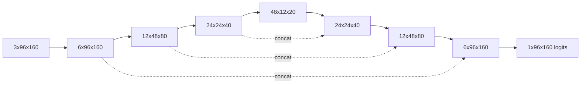

# LaneNet-v1 architecture

ดูแผนภาพและ shape table ใน [README.md](README.md) และ implementation ใน [model.py](model.py)

Network นี้เป็น custom residual encoder-decoder แบบ U ไม่ใช่โมเดลเดียวกับไฟล์ตัวอย่างแนบ: depth 3, channel 6/12/24/48, GroupNorm 3 groups, residual blocks และ bilinear decoder ทุก convolution เริ่มด้วย random Kaiming weights ขนาด spatial ปรับได้โดย interpolation อ้างอิงขนาด skip (รองรับขนาดไม่หาร 8 ลงตัวด้วย)

Logits ใช้กับ BCEWithLogitsLoss โดยตรง; inference ใช้ sigmoid แล้ว threshold > 0.5 จำนวน parameter ที่แน่นอนและ FP32 bytes วัดใน memory.json และสรุปผลใน README
